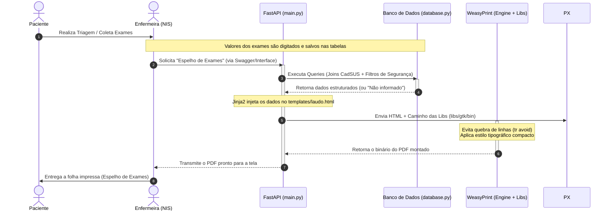

<p align="center">
  
  
  
  
</p>

<h2 align="center">🏥 Lab Reports Generator — NIS 🏥</h2>

---

## 🎯 Objetivo do Projeto
Gerador automatizado e padronizado de documentos ambulatoriais para o **Núcleo de Informação em Saúde (NIS)** da Prefeitura da Estância Turística de Paraguaçu Paulista. O sistema consome dados brutos de exames lançados após a triagem, cruza informações cadastrais do CadSUS e gera o **Espelho de Exames Laboratoriais**, um documento oficial em PDF altamente legível e otimizado tanto para auditoria interna quanto para o paciente levar para casa.

---

## ✨ Funcionalidades
* **Geração de PDF Clínico**: Conversão fiel de layouts complexos HTML5/CSS para formato A4.
* **Tratamento Dinâmico CadSUS**: Validação com travas de segurança (`fallback`) que injetam automaticamente "Não informado" para CPFs, CNSs ou nomes de mãe ausentes no banco.
* **Cabeçalhos Fluidos**: Layout inteligente que exibe o Brasão e dados municipais na primeira página e um cabeçalho técnico reduzido nas páginas seguintes.
* **Carimbo de Auditoria**: Emissão de rodapé integrado contendo a data de geração por extenso e o horário exato (`HH:MM`) em formato de texto.

---

## 📂 Estrutura do Projeto
```text
LAB-REPORTS-GENERATOR/
├── 📁 libs/             # Binários portáveis do GTK+ (Core gráfico do WeasyPrint para Windows)
│   └── 📁 gtk/bin/      # DLLs nativas essenciais (Cairo, Pango, Pixman, GLib, etc.)
├── 📁 static/           # Arquivos estáticos globais da aplicação
│   └── 📁 img/          # Banco de mídias e assets visuais do sistema
│       └── brasao.webp  # Brasão Oficial da Estância Turística de Paraguaçu Paulista
├── 📁 templates/        # Estrutura de visualização e marcação (Jinja2)
│   └── laudo.html       # Template base parametrizado com CSS Paged Media
├── .env                 # Variáveis de ambiente e credenciais sensíveis (Ignorado no Git)
├── .gitignore           # Filtros de arquivos e diretórios locais para versionamento
├── database.py          # Pool de conexões e execução de queries com tratamento CadSUS
├── main.py              # Endpoints FastAPI, regras de negócio e motor WeasyPrint
├── LICENSE              # Licença de uso e distribuição do software
├── README.md            # Documentação técnica do sistema (Este arquivo)
└── requirements.txt     # Dependências e pacotes Python do ecossistema
```

---

## 🧠 Arquitetura do Sistema
O sistema foi estruturado com foco em portabilidade autônoma em servidores Windows e isolamento de responsabilidades:

⚙️ Engine de Renderização & Dependências (/libs & /templates)
database.py / main.py: Camada que extrai os dados, realiza o tratamento preventivo de strings vazias e prepara o payload para o template engine Jinja2 injetar no arquivo templates/laudo.html.
Portabilidade Gráfica do WeasyPrint: Para evitar instalações complexas no sistema operacional do servidor, a pasta libs/gtk/bin/ distribui as DLLs em C/C++ nativas do GNOME:
libcairo-2.dll / libpixman-1-0.dll: Desenho vetorial e renderização geométrica.
libpango-1.0-0.dll / libfontconfig-1.dll: Mapeamento tipográfico e fontes.
libxml2-2.dll / libxslt-1.dll: Processamento estrutural do HTML.

---

### 🔀 Diagrama de Sequência e Ciclo de Vida do Relatório
O diagrama de sequência abaixo ilustra de forma técnica a jornada da informação e a interação entre os componentes do sistema, desde a entrada do paciente até o recebimento do documento impresso:



---

# Regras Normativas de Layout Aplicadas
O documento foi projetado sob réguas de design clínico e legibilidade hospitalar:

**Quebras de Página Inteligentes:** Configurado via CSS Paged Media (tr { page-break-inside: avoid; }) para impedir que uma linha de resultado de exame longo (como o Hemograma) seja fatiada horizontalmente entre duas páginas.

**Hierarquia Tipográfica:** O título principal recebe destaque com tamanho expandido (18px) contrastando com os dados da tabela em fonte compacta (10px). Isso otimiza o escaneamento visual para a enfermagem e reduz o desperdício de papel/toner.

**Cabeçalhos Fluidos:** Primeira página dedicada ao Brasão e Identificação Municipal. Páginas secundárias limpas, exibindo apenas o cabeçalho técnico simplificado do NIS.

**Carimbo de Auditoria:** Rodapé dinâmico integrado que exibe de forma clara a data por extenso e o horário exato da geração (.strftime("%H:%M")) para controle de retirada.

---

## 🚀 Como Executar o Projeto Localmente

1. Configure o Ambiente Virtual:
```Bash
python -m venv venv
.\venv\Scripts\activate
```

2. Instale as Dependências:
```Bash
pip install -r requirements.txt
```

3. Defina as Variáveis no .env:
Crie um arquivo .env na raiz preenchendo as strings de conexão com o banco de dados da triagem.

4. Inicie o Servidor:
```Bash
uvicorn main:app --reload
```
Acesse a interface de testes em: http://127.0.0.1:8000/docs