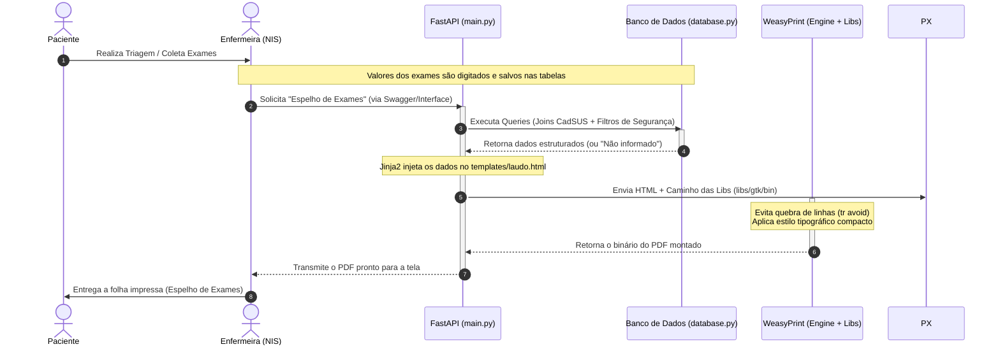

# 🏥 Lab Reports Generator — NIS

Gerador automatizado de relatórios e laudos ambulatoriais para o **Núcleo de Informação em Saúde (NIS)** da Prefeitura da Estância Turística de Paraguaçu Paulista. O sistema consome dados de exames laboratoriais, cruza informações cadastrais e gera um documento PDF oficial, padronizado e altamente legível chamado **Espelho de Exames Laboratoriais**.

---

## 🛠️ Stack Tecnológica & Dependências Nativas

O projeto é desenvolvido em **Python** utilizando o ecossistema moderno de APIs. Para a conversão fiel de layouts HTML/CSS complexos para formato PDF (respeitando regras normativas de quebras de página e folhas A4), utilizamos o **WeasyPrint**.

Como o ambiente Windows necessita dos binários de renderização gráfica do GNOME, o projeto distribui de forma portável as bibliotecas do **GTK+** dentro da estrutura do repositório.

### 🗄️ Estrutura de Bibliotecas Dinâmicas (`/libs`)

A pasta `libs/gtk/bin/` encapsula todas as dependências em C/C++ necessárias para a engine gráfica de PDF rodar no ecossistema Windows:

* **`libcairo-2.dll` / `libpixman-1-0.dll`**: Responsáveis por desenhar os vetores, imagens e formas geométricas nas páginas.
* **`libpango-1.0-0.dll` / `libfontconfig-1.dll`**: Gerenciam a tipografia, internacionalização e o carregamento das fontes do relatório.
* **`libxml2-2.dll` / `libxslt-1.dll`**: Processam os dados de marcação estrutural do documento HTML.
* **`libgdk-3-0.dll` / `libgtk-3-0.dll`**: Core do toolkit gráfico que amarra as dependências de renderização.

### 📄 Camada de Visão (`/templates`)

A pasta `templates/` contém a estrutura visual e esqueleto de marcação do documento:

* **`laudo.html`**: Template HTML5 estilizado com CSS Paged Media (regras `@page`). Ele utiliza marcadores do Jinja2 e tags de substituição dinâmicas (como `{{ carimbo_geracao_nis }}`) que são processadas em tempo de execução pelo backend antes de enviar o fluxo de dados para a engine do WeasyPrint.

# 🏥 Lab Reports Generator — NIS

Gerador automatizado e padronizado de documentos ambulatoriais para o **Núcleo de Informação em Saúde (NIS)** da Prefeitura da Estância Turística de Paraguaçu Paulista. O sistema consome dados brutos de exames lançados após a triagem e gera o **Espelho de Exames Laboratoriais**, um documento oficial em PDF otimizado tanto para auditoria interna quanto para o paciente levar para casa.

---

## 📂 Estrutura do Projeto

```text
LAB-REPORTS-GENERATOR/
├── 📁 libs/             # Binários portáveis do GTK+ (Core gráfico do WeasyPrint para Windows)
├── 📁 static/           # Arquivos estáticos globais da aplicação
│   └── 📁 img/          # Banco de mídias e assets visuais do sistema
│       └── brasao.webp  # Brasão Oficial da Estância Turística de Paraguaçu Paulista
├── 📁 templates/        # Estrutura de visualização e marcação (Jinja2)
│   └── laudo.html       # Template base parametrizado com CSS Paged Media
├── .env                 # Variáveis de ambiente e credenciais sensíveis (Ignorado no Git)
├── .gitignore           # Filtros de arquivos e diretórios locais para versionamento
├── database.py          # Pool de conexões e execução de queries com tratamento CadSUS
├── main.py              # Endpoints FastAPI, regras de negócio e motor WeasyPrint
├── LICENSE              # Licença de uso e distribuição do software
├── README.md            # Documentação técnica do sistema (Este arquivo)
└── requirements.txt     # Dependências e pacotes Python do ecossistema
```

---



---

# Regras Normativas de Layout Aplicadas
O documento foi projetado sob réguas de design clínico e legibilidade hospitalar:

## Quebras de Página Inteligentes
- Configurado via CSS (tr { page-break-inside: avoid; }) para impedir que uma linha de resultado de exame longo (ex: Hemograma) seja fatiada ao meio entre duas páginas.
## Hierarquia Tipográfica 
- Título com peso e destaque visual (18px) contrastando com o corpo de dados compacto (10px), o que reduz o desperdício de papel e otimiza o escaneamento visual da equipe de enfermagem.
## Cabeçalhos Fluidos
- Primeira página dedicada ao Brasão e Identificação Municipal. Páginas secundárias limpas, exibindo apenas o cabeçalho técnico simplificado do NIS.
## Carimbo de Auditoria 
- Rodapé dinâmico integrado que exibe de forma clara a data por extenso e o horário exato da geração (.strftime("%H:%M")) para controle de retirada.

---

## 🚀 Como Executar o Projeto Localmente

1. Configure o Ambiente Virtual:
```Bash
python -m venv venv
.\venv\Scripts\activate
```

2. Instale as Dependências:
```Bash
pip install -r requirements.txt
```

3. Defina as Variáveis no .env:
Crie um arquivo .env na raiz preenchendo as strings de conexão com o banco de dados da triagem.

4. Inicie o Servidor:
```Bash
uvicorn main:app --reload
```
Acesse a interface de testes em: http://127.0.0.1:8000/docs